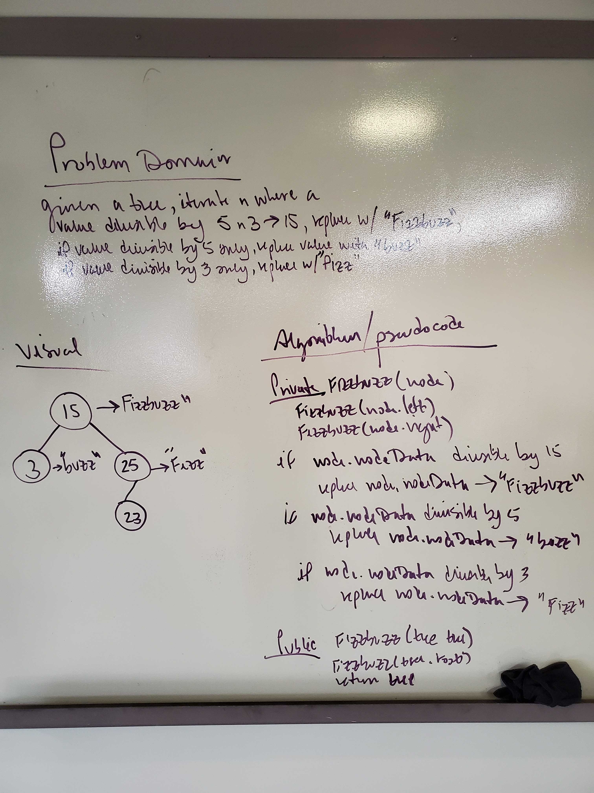

# FizzBuzz
Implementation of a method that takes a single tree and returns "FizzBuzz" for every value in tree that is divisible by 5 and 3. Fizz for values divisible by 5 only, and Buzz for values divisible by 3.

## Challenge
Create a method that will receive a tree as an argument, iterate over it, find values divisible by 5 and 3, 5, or 3.
## Approach & Efficiency
The method takes a Tree, returns a Tree with values modified on nodes matching criteria. Makes use of recursion to iterate over the Tree nodes, if a value is divisible by 15 it matches 3 and 5, 5, or 3 it will replace the respective value with FizzBuzz, Fizz, or Buzz. Returns the modified Tree.
## Solution
[FizzBuzz Code](/code401challenges/src/main/java/utilities/FizzBuzzTree.java)

