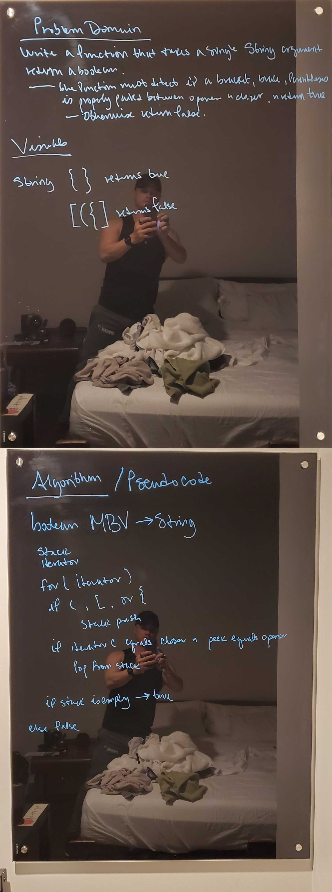

# Multi-Bracket Validation
Implementation of a method that takes a single String argument and returns a boolean if the string contains braces, brackets, or parentheses and they are properly terminated.

## Challenge
Create a method that will receive a string as an argument, iterate over it, detect opening brackets, braces, or parentheses, ignore regular text and properly identify if they are properly terminated or paired.

## Approach & Efficiency
The method takes a String, returns a boolean. Makes use of an iterator to iterate over the Strings characters, if an opening bracket, brace, or parentheses is found, it is pushed into a stack. after the openers are pushed, through if statements the closing pairs are detected, and when found their opener is popped of the stack. At the end, if a stack is empty the result returned is true for the string, otherwise false.

## Solution
[Multi Bracket Validator Code](/code401challenges/src/main/java/utilities/MultiBracketValidation.java)

