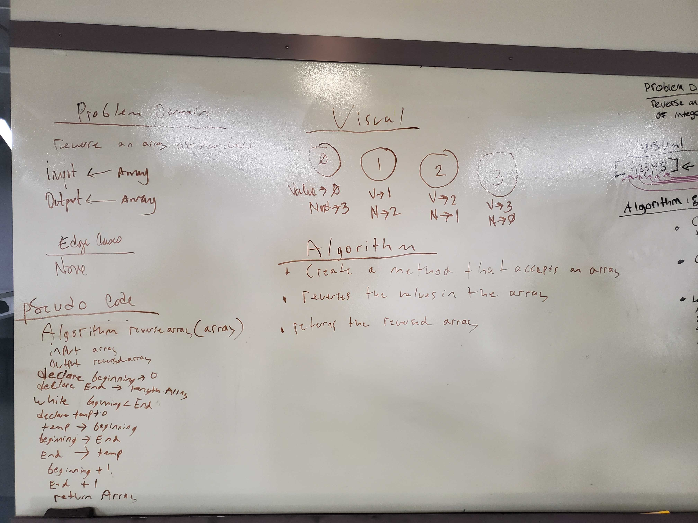

# Reverse an Array
Implementation of a function that takes an array as an argument and returns an array with values reversed

## Challenge
Function must reverse values regardless of the actual value, order must be the reverse of original array.

## Approach & Efficiency
Beginning, temporary and ending point variables declared, making use of a while loop and value comparison inverted values in array, final array returned and printed.
## Solution

