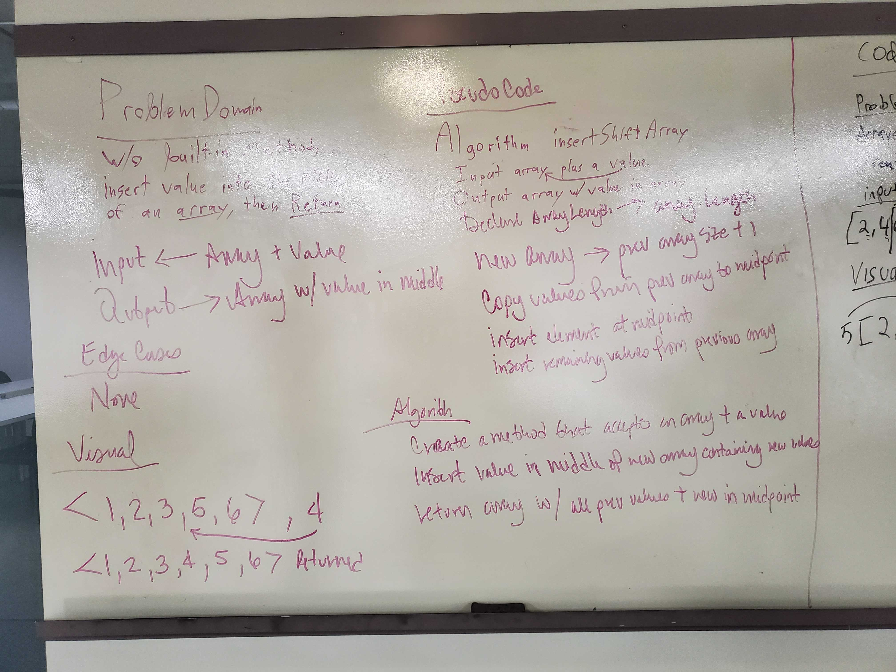
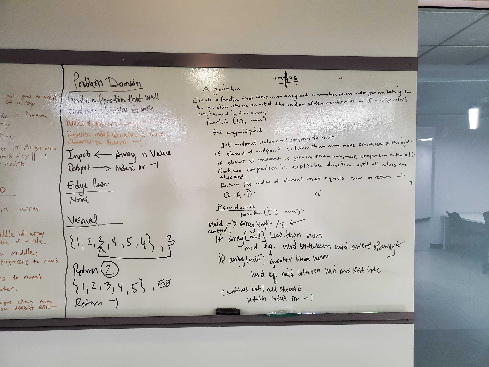

# Reverse an Array
Implementation of a function that takes an array and value as arguments, inserts value in midpoint and returns resulting array with value in place.

## Challenge
Function must insert value argument into the middle of argument array and return array.

## Approach & Efficiency
Midpoint of incoming array found, new array created with lenght + 1 of previousw array, in a for loop values are compared and sorted depending on pre-midpoint, midpoint, and post-midpoint location and then inserted in respective locations. Resulting array is returned.

## Solution

# Binary Search
Implementation of a function that takes an array and value as arguments, and performs a recursive search within the array for the value, returning the index for the value if found, or -1 if not found.

## Challenge
Function must search in the array passed as argument for value passed as argument and returned either the index of said value or -1 if not found.

## Approach & Efficiency
declare 3 variables, start, middle, and end points that will be modified as the while loop performs the search, the loop will only look for a single condition to end. The search will split the array in halves and search the halves depending on the range of numbers and where the passed in value would fall within the halves.

## Solution
[Binary Search](/src/main/java/code401challenges/BinarySearch.java)

